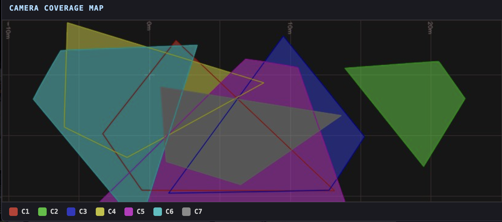

# multiview-bev-tracker


A **training-free** multi-camera Bird's Eye View (BEV) stitching and Re-Identification (ReID)
tracking system. Uses classical geometry for spatial alignment, pretrained embeddings for
identity, and Kalman + Hungarian for temporal consistency — no labeled data or model
fine-tuning required.

---

## Dashboard

The dashboard runs entirely in Docker — no local Python or Node installation required.

### Prerequisites

- [Docker Desktop](https://www.docker.com/products/docker-desktop/) (or Docker Engine + Compose plugin)
- WILDTRACK dataset at `data/wildtrack/` — see [Dataset Setup](#dataset-setup--wildtrack)
- Pretrained model weights in `models/` — see [Model Setup](#model-setup)

### 1. Download model weights

```bash
pip install gdown
python scripts/setup_models.py
```

### 2. Build and start

```bash
cd dashboard
docker compose up --build
```

The first build takes several minutes — it compiles torchreid from source.
Subsequent starts use the cached image and are much faster.

### 3. Open the dashboard

Navigate to **http://localhost:3000**.

The header shows a **Loading models…** badge while YOLO and OSNet initialise (~30–60 s).
Once it switches to **Processing**, frames are being tracked in the background.
Playback starts automatically when frame 0 is ready.

### 4. Controls

| Control | Action |
|---------|--------|
| **▶ Play / ⏸ Pause** | Start or pause frame playback (2 fps) |
| **Seek slider** | Jump to any processed frame |
| **Track list** (right panel) | Click a track to highlight it across all cameras |
| **Camera Coverage** (8th grid cell) | Opens the static camera footprint map |

<p align="center">
  
</p>

### 5. Stop

```bash
# Ctrl-C in the compose terminal, then:
docker compose down
```

### How it works

```
Browser → http://localhost:3000
    └──── nginx (frontend container, port 3000)
            ├── /       → serves the React + TypeScript SPA
            └── /api/*  → reverse-proxied to backend:8000
                               ├── GET /api/info            processing status
                               ├── GET /api/frame/{n}       BEV image + camera frames + tracks
                               ├── GET /api/homographies    camera calibration metadata
                               └── GET /api/bev-coverage    static coverage diagram
```

The backend processes all frames once at startup and caches results in memory.
`data/` and `models/` are mounted read-only into the backend container — nothing
is written back to the host.

---

## Architecture

```
Multi-camera frames
      ↓
2D Detector (YOLOv8-nano, pretrained)
      ↓
Bounding-box bottom-center → ground-plane projection (per-camera homography)
      ↓
Global BEV coordinates
      ↓
Detection deduplication (1.0 m NMS across cameras)
      ↓
ReID embedding extraction (OSNet-x0.25, pretrained)
      ↓
Kalman prediction + Hungarian association
      ↓
Unified world tracks  (min 6 confirmed frames, inside BEV range)
```

---

## Tracking Evaluation — WILDTRACK

Evaluated on 5 consecutive frames (frames 0–4), 7 cameras, 34–38 annotated
persons per frame. Tracks are matched to ground-truth world positions using
the Hungarian algorithm with a 2 m gate.

| Frame | GT persons | Active tracks | Matched | Recall | Mean dist (m) |
|------:|----------:|-------------:|--------:|-------:|--------------:|
| 0 | 38 | 107 | 35 | 0.92 | 0.28 |
| 1 | 36 | 120 | 35 | 0.97 | 0.36 |
| 2 | 34 | 137 | 33 | 0.97 | 0.36 |
| 3 | 36 | 145 | 34 | 0.94 | 0.30 |
| 4 | 36 | 152 | 34 | 0.94 | 0.37 |
| **Mean** | | | | **0.95** | **0.33** |

**Recall 92–97%** — the pipeline recovers nearly every annotated person.
**Mean position error 0.33 m** — tracks land within ~33 cm of ground truth,
well inside a person's footprint.

Active track count exceeds GT count (~3–4×) because each of the 7 cameras
independently detects and projects the same person, producing multiple
slightly-offset tracks per individual. A cross-camera merging step would
reduce this; it is out of scope for a training-free baseline.

---

## Key Design Decisions

| Component | Choice | Reason |
|-----------|--------|--------|
| Detector | YOLOv8-nano (Ultralytics) | Fastest pretrained 2D detector |
| ReID | OSNet-x0.25 (torchreid) | Lightest accurate embedding model |
| Tracker | Custom Kalman + Hungarian | World-coordinate SORT variant |
| Stitching | Per-camera homography | No depth prediction needed |
| Dedup | 1.0 m NMS pre-tracker | Collapses multi-camera duplicates |

---

## Repository Layout

```
multiview-bev-tracker/
├── .github/workflows/ci.yml   # Lint-only CI
├── configs/
│   ├── default.yaml           # Generic runtime configuration
│   └── wildtrack.yaml         # WILDTRACK-specific configuration
├── dashboard/
│   ├── docker-compose.yml     # Orchestrates backend + frontend
│   ├── backend/
│   │   ├── Dockerfile         # Build context: project root
│   │   ├── main.py            # FastAPI server + tracking pipeline
│   │   └── requirements.txt   # fastapi, uvicorn
│   └── frontend/
│       ├── Dockerfile         # Node build → nginx serve
│       ├── nginx.conf         # Reverse-proxies /api/* to backend
│       └── src/               # React + TypeScript + Vite app
├── data/                      # Input data (gitignored — see Dataset Setup)
├── models/                    # Downloaded weights (gitignored — see Model Setup)
├── resources/                 # README assets (demo gif, coverage map)
├── scripts/
│   ├── run_tracker.py         # CLI entry point
│   └── setup_models.py        # Model weight downloader
├── src/bev_tracker/
│   ├── core/                  # Shared dataclasses (Camera, Detection, Track)
│   ├── datasets/              # Dataset loaders (WildtrackDataset)
│   ├── detection/             # YOLOv8 wrapper
│   ├── projection/            # Homography projection
│   ├── reid/                  # OSNet embedding extractor
│   ├── tracking/              # Kalman filter + Hungarian association + Tracker
│   ├── utils/                 # Shared utilities (device auto-detection)
│   ├── visualization/         # BEV renderer
│   └── pipeline.py            # Main loop
└── tests/
```

---

## Dataset Setup — WILDTRACK

The built-in dataset loader targets the
[WILDTRACK Multi-Camera Dataset](https://www.epfl.ch/labs/cvlab/data/data-wildtrack/)
(Chavdarova et al., CVPR 2018) — a 7-camera, HD, synchronized pedestrian dataset
with ground-truth calibration and annotations.

### 1. Download

Request or download the dataset from the official source:

> **https://www.epfl.ch/labs/cvlab/data/data-wildtrack/**

You will receive (or can unzip) a directory called `Wildtrack_dataset/` containing:

```
Wildtrack_dataset/
├── Image_subsets/C{1-7}/   # 400 synchronized PNG frames per camera
├── calibrations/
│   ├── extrinsic/          # extr_<CameraName>.xml  (rvec + tvec in cm)
│   └── intrinsic_zero/     # intr_<CameraName>.xml  (3×3 camera matrix K)
└── annotations_positions/  # 00000000.json … (personID, positionID, bboxes)
```

### 2. Place data

Copy (or symlink) the dataset contents to `data/wildtrack/` inside this repo:

```bash
cp -r /path/to/Wildtrack_dataset/. data/wildtrack/
# or: ln -s /path/to/Wildtrack_dataset data/wildtrack
```

The `data/` directory is gitignored, so nothing is committed.

### 3. Verify

```bash
python - <<'EOF'
from bev_tracker.datasets import WildtrackDataset
ds = WildtrackDataset("data/wildtrack")
print(f"Cameras : {ds.num_cameras}")   # 7
print(f"Frames  : {ds.num_frames}")    # 400
print(f"H[C1]   : {ds.homography(0).shape}")  # (3, 3)
EOF
```

### Coordinate system

| Property | Value |
|----------|-------|
| Grid | 480 × 1440 cells |
| Cell size | 2.5 cm (0.025 m) |
| World X range | −3.0 m → 9.0 m |
| World Y range | −9.0 m → 27.0 m |
| Origin | `positionID = 0` → (−3.0 m, −9.0 m) |

Homographies are computed from the OpenCV XML calibration files and map the
z=0 ground plane (in **metres**) to image pixels. This is fully consistent with
the `project_to_world` / `Camera.homography_inv` API used throughout the pipeline.

---

## Model Setup

Download pretrained weights before running the dashboard or integration tests:

```bash
# Install gdown if not already present
pip install gdown

# Download YOLOv8n + OSNet-x0.25 (Market-1501) to models/
python scripts/setup_models.py
```

Individual downloads:

```bash
python scripts/setup_models.py --yolo    # YOLOv8n only
python scripts/setup_models.py --osnet   # OSNet only
```

---

## Local Development

Use the `bev-tracker` conda environment for all Python work.

### Conda environment

#### Option A — Apple Silicon (M1/M2/M3) with MPS acceleration

```bash
conda create -n bev-tracker python=3.11 -y
conda activate bev-tracker
pip install -r requirements.txt
pip install --no-build-isolation \
    git+https://github.com/KaiyangZhou/deep-person-reid.git
pip install -e ".[dev]"
```

#### Option B — Intel Mac / Rosetta 2 (osx-64, CPU-only)

```bash
CONDA_SUBDIR=osx-64 conda create -n bev-tracker python=3.11 -y
conda activate bev-tracker
conda config --env --set subdir osx-64
pip install -r requirements.txt
pip install --no-build-isolation \
    git+https://github.com/KaiyangZhou/deep-person-reid.git
pip install -e ".[dev]"
```

#### Option C — Linux (CPU or CUDA)

```bash
pip install -r requirements.txt
pip install --no-build-isolation \
    git+https://github.com/KaiyangZhou/deep-person-reid.git
pip install -e ".[dev]"
```

### Lint and tests

```bash
# Lint (run inside bev-tracker conda env)
ruff check .
ruff format --check .

# Unit tests — no models or data required
pytest -m "not integration"

# Integration tests — requires data/wildtrack/ and models/
pytest
```

### Frontend

Frontend checks run inside Docker to match CI:

```bash
cd dashboard
docker compose build frontend   # npm install + tsc + vite build
```
